# 🐞 DevTrack — Engineering Issues API

> A lightweight Django REST API for tracking engineering issues, priorities, statuses, and reporters.

DevTrack is a small backend project inspired by **GitHub Issues**. It allows engineering teams to create reporters, raise issues, assign priorities, track issue status, and retrieve issues through a simple REST API.

The project is built with **Python, Django, and Django REST Framework**, with JSON files used for lightweight data persistence.

---

## ✨ Features

* 👤 Create and retrieve reporters
* 🐞 Create and retrieve engineering issues
* 🚦 Track issue status
* 🔥 Assign issue priority
* 🔗 Associate issues with reporters
* 🔎 Filter issues by priority
* 🕒 Automatically generate issue creation time
* 🆔 Automatically generate UUIDs
* ✅ Request validation
* ❌ Meaningful HTTP error responses
* 🧩 OOP-based issue classes with inheritance and method overriding
* 🗂️ Simple JSON-file persistence

---

## 🛠️ Tech Stack

| Technology            | Purpose                      |
| --------------------- | ---------------------------- |
| Python                | Programming language         |
| Django                | Backend web framework        |
| Django REST Framework | REST API development         |
| JSON                  | Lightweight data persistence |
| Postman               | API testing                  |

---

# 🚀 Getting Started

Follow the steps below to create the project from scratch.

## 1. Create the project folder

Open PowerShell or Command Prompt:

```powershell
mkdir devtrack
cd devtrack
```

---

## 2. Create and activate a virtual environment

Create the virtual environment:

```powershell
python -m venv .venv
```

Activate it on Windows:

```powershell
.venv\Scripts\activate
```

After activation, you should see something similar to:

```text
(.venv) PS C:\...\devtrack>
```

---

## 3. Install Django and Django REST Framework

Install Django:

```powershell
pip install django
```

Install Django REST Framework:

```powershell
pip install djangorestframework
```

---

## 4. Start the Django project

Create the Django project:

```powershell
django-admin startproject devtrack .
```

The `.` at the end is important because it creates the project in the current directory.

Your structure should now look like:

```text
devtrack/
│
├── manage.py
│
└── devtrack/
    ├── __init__.py
    ├── settings.py
    ├── urls.py
    ├── asgi.py
    └── wsgi.py
```

---

## 5. Create the `issues` app

Run:

```powershell
python manage.py startapp issues
```

Your project will now look approximately like:

```text
devtrack/
│
├── manage.py
│
├── devtrack/
│   ├── settings.py
│   ├── urls.py
│   └── ...
│
└── issues/
    ├── migrations/
    ├── __init__.py
    ├── admin.py
    ├── apps.py
    ├── models.py
    ├── tests.py
    └── views.py
```

---

# ⚙️ Project Configuration

## 6. Register the app and Django REST Framework

Open:

```text
devtrack/settings.py
```

Add both `rest_framework` and `issues` to `INSTALLED_APPS`:

```python
INSTALLED_APPS = [
    'django.contrib.admin',
    'django.contrib.auth',
    'django.contrib.contenttypes',
    'django.contrib.sessions',
    'django.contrib.messages',
    'django.contrib.staticfiles',

    'rest_framework',
    'issues',
]
```

---

# 📦 Requirements File

## 7. Create `requirements.txt`

Once all dependencies are installed, generate the requirements file:

```powershell
pip freeze > requirements.txt
```

This records the installed Python packages and their versions.

A new developer can then install all dependencies using:

```powershell
pip install -r requirements.txt
```

Use this command whenever the project is being set up on a new machine.

---

# ▶️ Run the Project

Start the Django development server:

```powershell
python manage.py runserver
```

The API will be available at:

```text
http://127.0.0.1:8000/
```

All API routes are prefixed with:

```text
/api/
```

---

# 📁 Project Structure

```text
devtrack/
│
├── manage.py
├── requirements.txt
├── README.md
│
├── devtrack/
│   ├── __init__.py
│   ├── settings.py
│   ├── urls.py
│   ├── asgi.py
│   └── wsgi.py
│
└── issues/
    ├── __init__.py
    ├── admin.py
    ├── apps.py
    ├── models.py
    ├── views.py
    ├── urls.py
    │
    └── files/
        ├── reporters.json
        └── issues.json
```

---

# 🔌 API Endpoints

All endpoints accept and return JSON.

Use a trailing `/` on each URL.

## 👤 Reporter APIs

| Method | Endpoint               | Description            |
| ------ | ---------------------- | ---------------------- |
| `GET`  | `/api/reporters/`      | Get all reporters      |
| `GET`  | `/api/reporters/<id>/` | Get a reporter by UUID |
| `POST` | `/api/reporters/`      | Create a new reporter  |

### Create Reporter

**POST**

```text
/api/reporters/
```

### Request

```json
{
    "name": "Alex Morgan",
    "email": "alex.morgan@example.com",
    "team": "Engineering"
}
```

The server generates the reporter UUID.

### Example Response

```json
{
    "reporter": {
        "id": "generated-uuid",
        "name": "Alex Morgan",
        "email": "alex.morgan@example.com",
        "team": "Engineering"
    }
}
```

---

# 🐞 Issue APIs

| Method | Endpoint                         | Description               |
| ------ | -------------------------------- | ------------------------- |
| `GET`  | `/api/issues/`                   | Get all issues            |
| `GET`  | `/api/issues/<id>/`              | Get an issue by UUID      |
| `GET`  | `/api/issues/?search=<priority>` | Filter issues by priority |
| `POST` | `/api/issues/`                   | Create a new issue        |

---

## Create Issue

**POST**

```text
/api/issues/
```

### Request

```json
{
    "title": "Login page returns an error",
    "description": "Users receive an error when submitting valid login details.",
    "status": "open",
    "priority": "high",
    "reporter_id": "reporter-id"
}
```

The server:

* Generates the issue UUID
* Sets the creation time
* Validates the issue
* Verifies the reporter
* Stores the issue in `issues.json`

The server generates the reporter UUID.

### Example Response

```json
{
    "issue": {
        "id": "generated-uuid",
        "title": "Login page returns an error",
        "description": "Users receive an error when submitting valid login details.",
        "status": "open",
        "priority": "high",
        "reporter_id": "reporter-id",
        "created_at": "2026-10-05 15:44:30.230375",
        "message": "Login page returns an error - [high]"
    }
}
```

---

# 🚦 Issue Status

The following statuses are supported:

```text
open
in_progress
resolved
closed
```

Example:

```json
{
    "status": "in_progress"
}
```

---

# 🔥 Issue Priority

The following priorities are supported:

```text
low
medium
high
critical
```

Priority determines how the issue is represented by the OOP classes.

```text
Issue
├── CriticalIssue
└── LowPriorityIssue
```

For example:

### Critical Issue

```text
[URGENT] Login page returns an error — needs immediate attention
```

### Low Priority Issue

```text
Update button text — low priority, handle when free
```

Medium and high priority issues use the base `Issue` class.

---

# 🧩 OOP Design

The project uses object-oriented programming to model the issue domain.

The base class is:

```text
BaseEntity
     │
     ├── Reporter
     │
     └── Issue
          │
          ├── CriticalIssue
          │
          └── LowPriorityIssue
```

`BaseEntity` provides common functionality such as:

* `validate()`
* `to_dict()`

`Issue` provides the common issue behavior.

### Polymorphism
`CriticalIssue` and `LowPriorityIssue` override the `describe()` method to provide priority-specific behavior.

### Encapsulation
`Issue` stores its message in the internal `_message` attribute. Callers read it through the read-only `message` property and update it with `set_message()`, keeping changes behind the class interface. `Issue.to_dict()` maps `_message` to `message` so the internal name does not appear in JSON.

This demonstrates:

* **Abstraction**
* **Inheritance**
* **Method overriding**
* **Polymorphism**
* **Encapsulation**

---

# 🏭 Factory Pattern

The project can use the **Factory Pattern** to determine which Issue subclass should be created based on priority.

Conceptually:

```text
                  IssueFactory
                       │
          ┌────────────┼────────────┐
          ↓            ↓            ↓
      critical        low       medium/high
          │            │            │
          ↓            ↓            ↓
 CriticalIssue   LowPriorityIssue   Issue
```

This keeps object-creation logic separate from the API view and makes the code easier to extend if additional issue types are introduced later.

---

# 🔎 Filtering Issues

Issues can be filtered by priority using the `search` query parameter.

### Example

```text
GET /api/issues/?search=critical
```

This returns only critical issues.

Supported values:

```text
low
medium
high
critical
```

---

# ❌ Validation & Error Handling

The API returns appropriate HTTP status codes when requests fail.

### Example — Invalid Reporter

If the requested reporter does not exist:

```json
{
    "error": "Reporter not found"
}
```

Response:

```text
404 Not Found
```

### Example — Invalid Issue

```json
{
    "error": "Issue not found"
}
```

Response:

```text
404 Not Found
```

### Example — Validation Error

If an issue title is empty:

```json
{
    "error": "Title cannot be empty"
}
```

Response:

```text
400 Bad Request
```

---

# 💾 Data Storage

DevTrack uses two JSON files for persistence:

```text
issues/files/
├── reporters.json
└── issues.json
```

Example `reporters.json`:

```json
[
    {
        "id": "reporter-uuid",
        "name": "Alex Morgan",
        "email": "alex.morgan@example.com",
        "team": "Engineering"
    }
]
```

Example `issues.json`:

```json
[
    {
        "id": "issue-uuid",
        "title": "Login page returns an error",
        "description": "Users receive an error when submitting valid login details.",
        "status": "open",
        "priority": "critical",
        "reporter_id": "reporter-uuid",
        "created_at": "2026-10-05 12:30:00"
    }
]
```

---

# 🧠 Design Decision

### Why JSON instead of a database?

This project uses JSON files rather than database tables because the goal is to keep the exercise lightweight and easy to run.

Using JSON provides:

* Simple setup
* No database configuration
* Easy inspection of stored data
* Easy sharing of the project

The tradeoff is that JSON-file storage is **not suitable for production workloads**, especially when multiple requests may write to the file concurrently or when the amount of data becomes large.

For a production application, a relational database such as PostgreSQL would be a better choice.

---

# 🧪 Testing with Postman

The API can be tested using **Postman**.

Recommended test flow:

### 1. Create a Reporter

```text
POST /api/reporters/
```

Verify that the reporter is created successfully.

### 2. Get All Reporters

```text
GET /api/reporters/
```

Verify that the newly created reporter is returned.

### 3. Create an Issue

Use the reporter UUID from the previous request:

```text
POST /api/issues/
```

### 4. Get All Issues

```text
GET /api/issues/
```

### 5. Filter Issues

```text
GET /api/issues/?search=critical
```

### 6. Test a Failure

For example, request an issue UUID that does not exist:

```text
GET /api/issues/<invalid-uuid>/
```

Expected:

```text
404 Not Found
```

---

# 📸 Postman API Screenshots

The following screenshots demonstrate the API endpoints tested using Postman.

## 1. POST Reporter — Success Response

A successful `POST /api/reporters/` request.

**Request:**

```text
POST /api/reporters/
```

**Expected Response:**

```text
201 Created
```

📷 **Screenshot:**

> 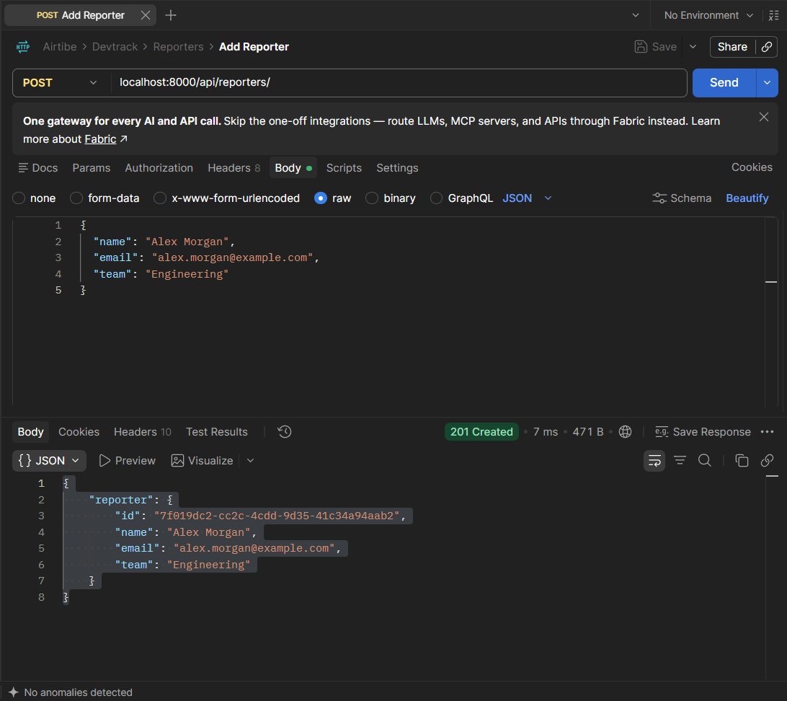

---

## 2. POST Reporter — Failed Response

A failed `POST /api/reporters/` request demonstrating API validation/error handling.

**Request:**

```text
POST /api/reporters/
```

**Expected Response:**

```text
400 Bad Request
```

📷 **Screenshot:**

> 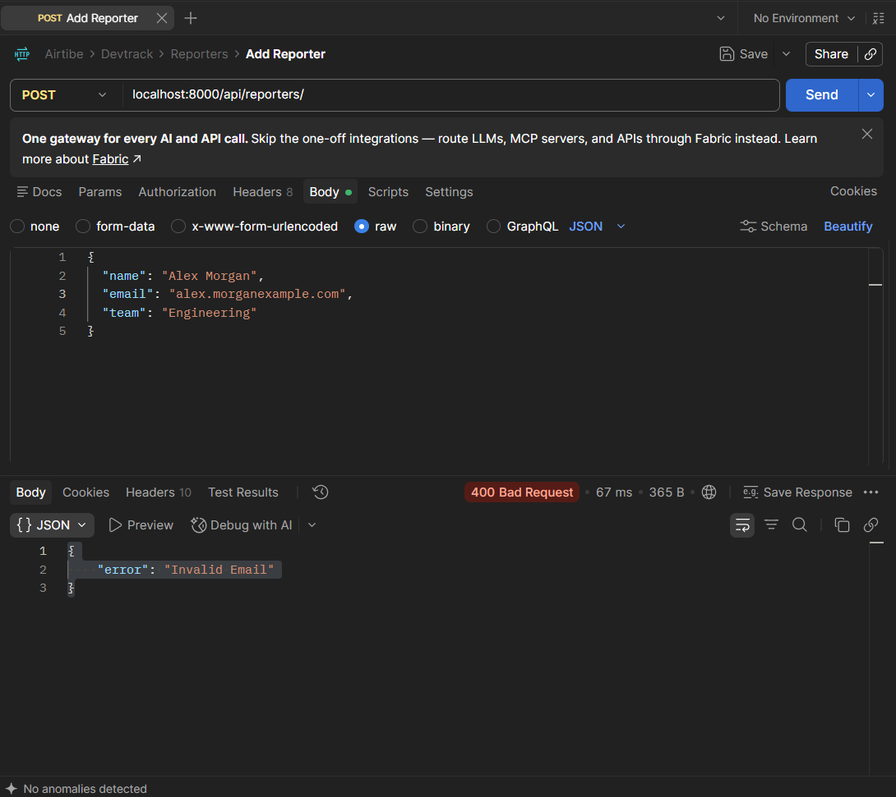

---

## 3. POST Issue — Success Response

A successful `POST /api/issues/` request.

**Request:**

```text
POST /api/issues/
```

**Expected Response:**

```text
201 Created
```

📷 **Screenshot:**

> 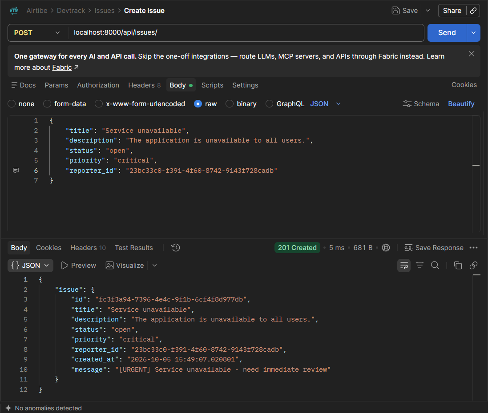

---

## 4. POST Issue — Failed Response

A failed `POST /api/issues/` request demonstrating API validation/error handling.

**Request:**

```text
POST /api/issues/
```

**Expected Response:**

```text
400 Bad Request
```

📷 **Screenshot:**

> 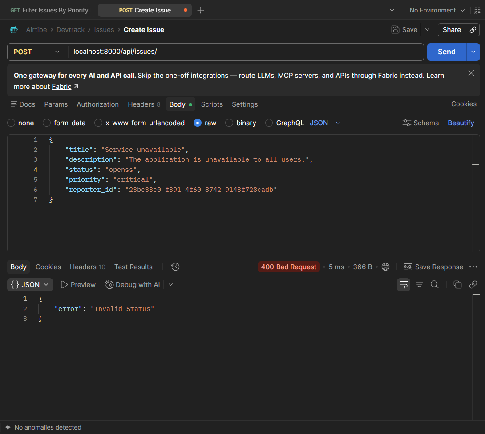

---

## 5. GET Reporters 

Screenshot showing the successful response from:

```text
GET /api/reporters/
```

📷 **Screenshot:**

> 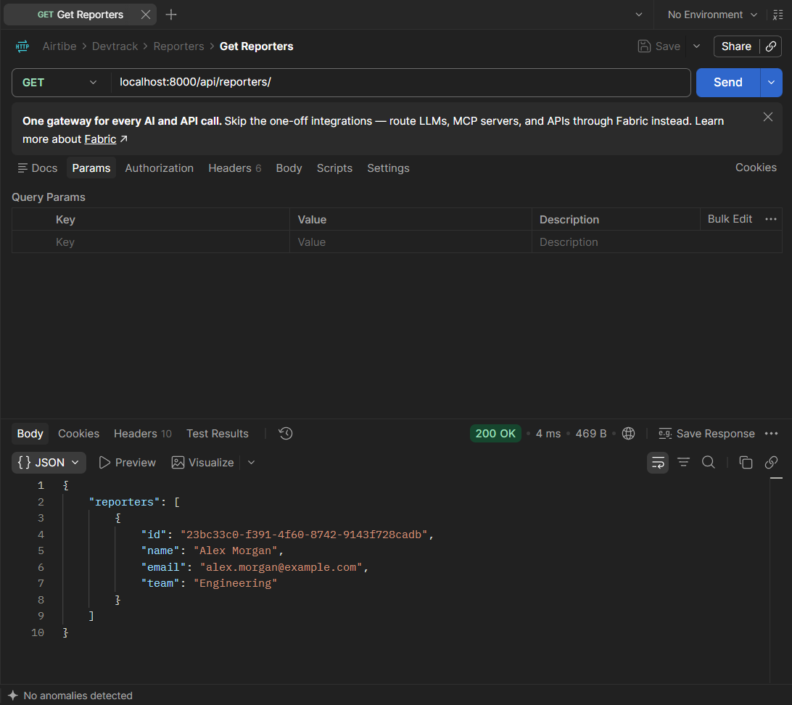

---

## 6. GET Issues

Screenshot showing the successful response from:

```text
GET /api/issues/
```

📷 **Screenshot:**

> 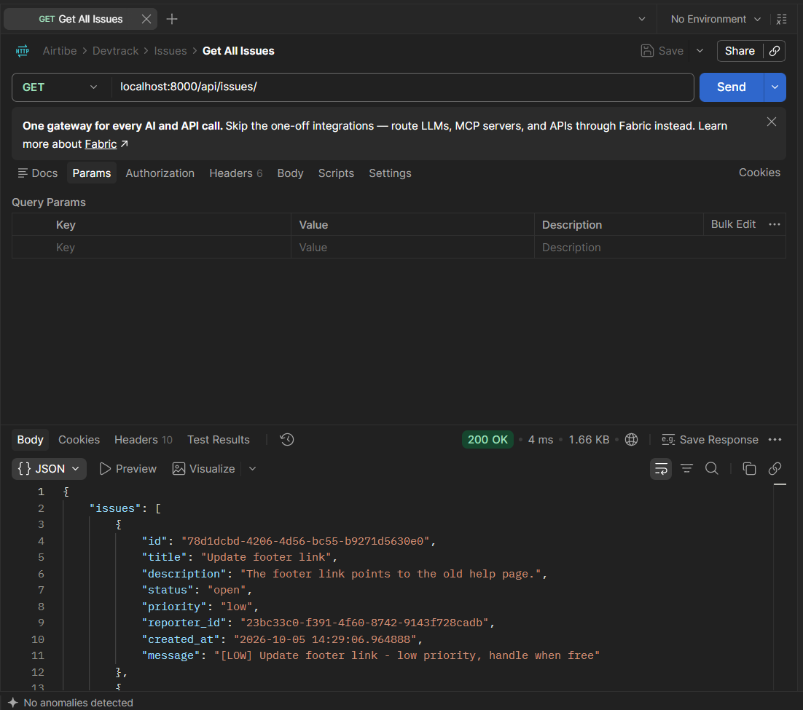

---

## 7. GET Reporter by ID — Success Response

Screenshot showing the response from:

```text
GET /api/reporters/<id>/
```

**Expected Response:**

```text
200 OK
```

📷 **Screenshot:**

> 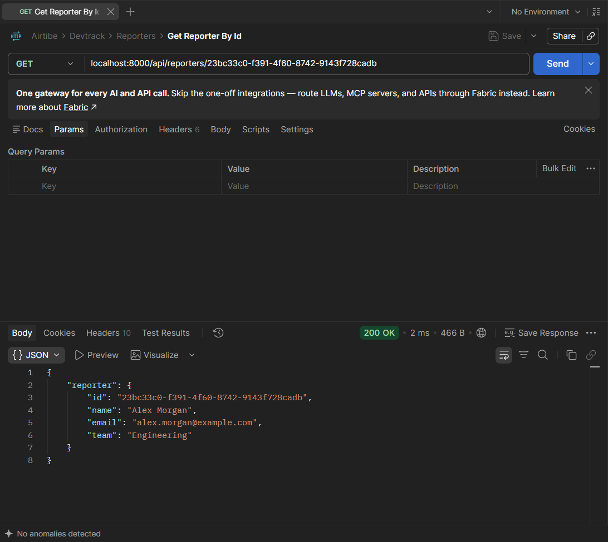

---

## 8. GET Reporter by ID — Failed Response

A failed `GET /api/reporters/<id>/` request demonstrating API validation/error handling.

**Request:**

```text
GET /api/reporters/<id>/
```

**Expected Response:**

```text
404 Not Found
```

📷 **Screenshot:**

> 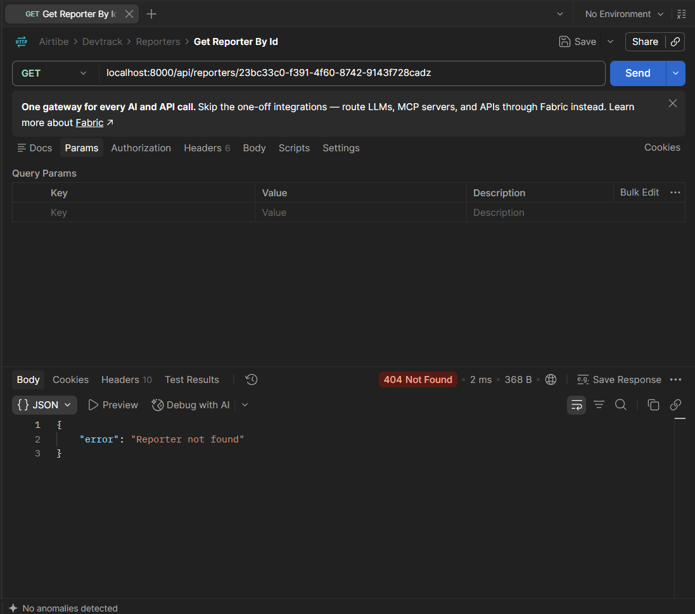

---

## 9. GET Issue by ID — Success Response

Screenshot showing the response from:

```text
GET /api/issues/<id>/
```

**Expected Response:**

```text
200 OK
```

📷 **Screenshot:**

> 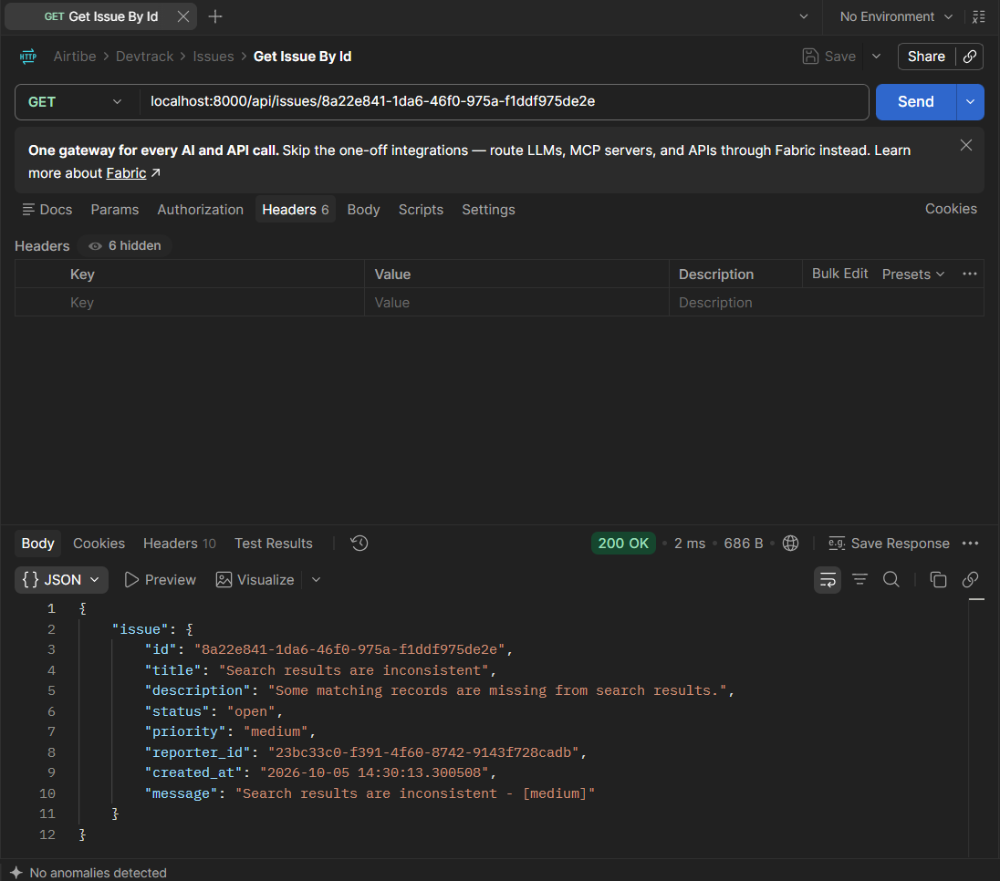

---

## 10. GET Issue by ID — Failed Response

A failed `GET /api/issues/<id>/` request demonstrating API validation/error handling.

**Request:**

```text
GET /api/issues/<id>/
```

**Expected Response:**

```text
404 Not Found
```

📷 **Screenshot:**

> 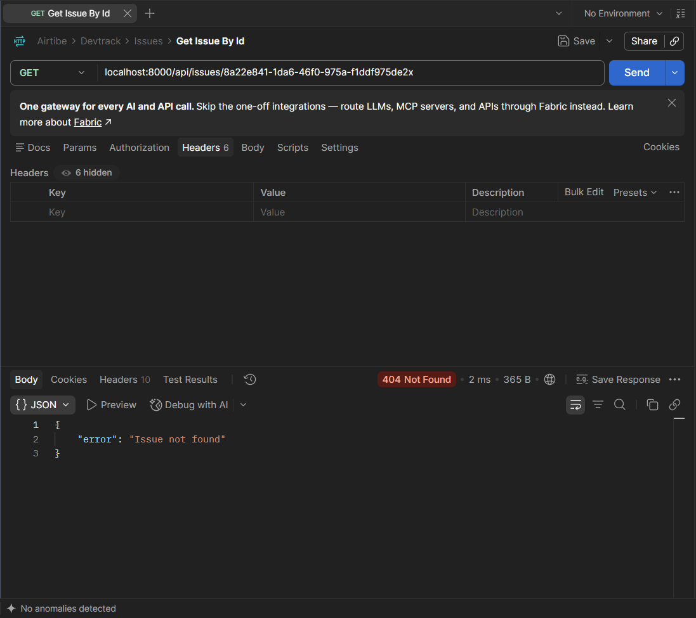

---

## 11. GET Issues by Priority

Screenshot showing the response from:

```text
GET /api/issues/?search=critical
```

📷 **Screenshot:**

> 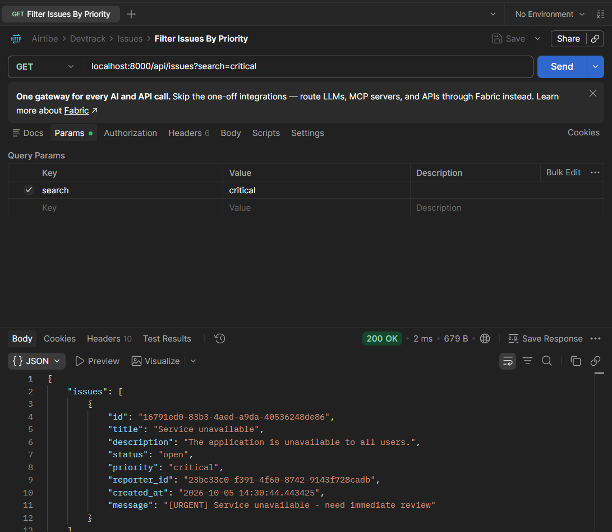

---

# 📋 API Quick Reference

```text
REPORTERS
────────────────────────────────────────────

POST    /api/reporters/
GET     /api/reporters/
GET     /api/reporters/<id>/


ISSUES
────────────────────────────────────────────

POST    /api/issues/
GET     /api/issues/
GET     /api/issues/<id>/
GET     /api/issues/?search=<priority>
```

---

# 👩‍💻 Author

**DevTrack**

Built as a Django REST Framework backend project to practice:

* Python OOP
* Django
* Django REST Framework
* REST API design
* JSON persistence
* Inheritance & polymorphism
* Factory Pattern
* API validation
* Postman testing

---

## ⭐ Learning Goal

DevTrack is intentionally small, but the design mirrors concepts used in larger backend systems:

```text
HTTP Request
     ↓
Django REST API
     ↓
Validation
     ↓
OOP Domain Objects
     ↓
Factory / Polymorphism
     ↓
JSON Persistence
     ↓
HTTP Response
```

The goal is not just to make the endpoints work, but to understand **how different backend concepts fit together into a complete API**.
